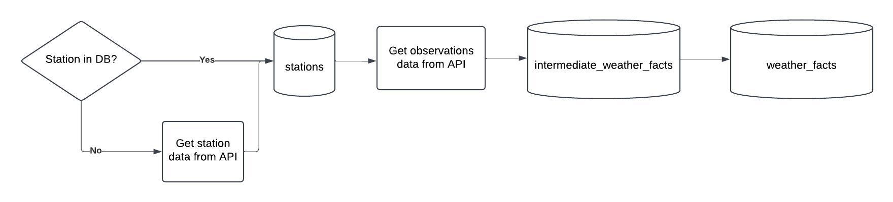

# Weather Data Pipeline

## Prerequisites
- Docker installed on your system

## Setup
1. Create a `.env` file (or just `copy` `.env.example` file)

```bash
cp .env.example .env
```

2. Start the containers:

```bash
docker compose up
```


## Access Points
- **Mage UI**: `http://localhost:6789`
- **PostgreSQL Database**: 
  - Host: `localhost`
  - Port: `5432`
  - Database,  User, Password, Schema: set in `.env` file
  
## Design Spec

### Description

This pipeline fetches seven days of weather information from the National Weather Service for a specified station.

The goal of this pipeline is to answer the following questions for that station:
- Which is the average observed temperature for last week(Mon-Sun)?
- Which is the maximum wind speed change between two consecutive observations in the last 7
days?


### Flow Diagram


### Schemas

`stations`: This dimension table stores the station's data

| Column Name | Column Type | Column Comment |
|-----------|-----------|-----------|
| id    | SERIAL   | This is the unique identifier of a station |
| external_id    | TEXT    | Station identifier on the National Weather Service API    |
| name    | TEXT    | Name of the station   |
| timezone    | TEXT    | Timezone in which the station is located    |
| lat    | NUMERIC    | Latitude of the station's location coordinates    |
| long    | NUMERIC    |  Longitude of the station's location coordinates   |

`weather_facts`: This table lists the weather measures taken on a specific time for a station. The unique identifier for this table is (`dim_station_id, obs_timestamp`)

| Column Name | Column Type | Column Comment |
|-----------|-----------|-----------|
| dim_station_id    | INTEGER    | Station identifier, foreign key that references `stations(id)`   |
| obs_timestamp    | TEXT    | Timestamp (in the station's timezone) for the observed measures     |
| m_temperature    | NUMERIC    | Measure of the temperature on the given timestamp for the station    |
| m_wind_speed    | NUMERIC    | Measure of the wind speed on the given timestamp for the station    |
| m_humidity    | NUMERIC    | Measure of the humidity on the given timestamp for the station    |


### Quality Checks
- No null values allowed in `stations` or `weather_facts` tables
- No duplicate records allowed in `stations` or `weather_facts` tables
  
### Notes

The **insert only new records requirement** is handled differently for stations and observations.

For stations:
- The pipeline implements a conditional approach. It checks if data for that station already exists in the database, if no data is found, It triggers an API request to get the station's data from the National Weather Service (this avoids unnecessary hits on the external service API).
  
For observations:
- Duplicate prevention is handled through an intermediate table strategy, new data is first loaded into `intermediate_weather_facts` table, which has the same schema than `weather_facts`, then a `JOIN` operation between this table and `weather_facts` identifies and inserts only new records into the latter
.


## Runtime Variables
The pipeline accepts two parameters:

1. `station_id` (default: "0128W")
   - Weather station identifier **on the National Weather Service API**

2. `reference_date` (optional)
   - Format: "yyyy-mm-dd"
   - If not provided, defaults to execution date
   - Pipeline will fetch data from reference date back to 7 days prior
  
## Pipeline Execution Guide

1. Navigate to `http://localhost:6789/pipelines`
2. Click on the pipeline name (e.g., "weather_data")
3. Click the "Run@Once" button to create a new trigger
4. In the trigger configuration, you can set:
   - `station_id`: Weather station identifier on the National Weather Service API
   - `reference_date`: Target date in "yyyy-mm-dd" format
  
To get more information on the status of the execution you can click on the auto-generated trigger name or click on the `logs` icon, also you can check [mage documentation](https://docs.mage.ai/design/data-pipeline-management) to get familiar with the UI.


## Analytics Queries

Which is the average observed temperature for last week(Mon-Sun)?

```SQL
WITH facts_in_utc AS (
SELECT
	wf.*,
	wf.obs_timestamp::TIMESTAMP AT TIME ZONE s.timezone AT TIME ZONE 'UTC' AS utc_obs_timestamp
FROM
	weather_facts wf
JOIN stations s ON
	wf.dim_station_id = s.id 
),
last_week_facts AS (
SELECT
	*
FROM
	facts_in_utc
WHERE
	(utc_obs_timestamp >= date_trunc('week',
	NOW() AT TIME ZONE 'UTC' - INTERVAL '1 week')
		AND
       utc_obs_timestamp < date_trunc('week',
		NOW() AT TIME ZONE 'UTC')
      ) 
)

SELECT dim_station_id, AVG(m_temperature) AS last_week_avg_temp 
FROM last_week_facts
GROUP BY dim_station_id
```


Which is the maximum wind speed change between two consecutive observations in the last 7
days?

```SQL
WITH last_seven_days_facts AS (
SELECT
	wf.*
FROM
	weather_facts wf
JOIN stations s ON
	wf.dim_station_id = s.id
WHERE
	wf.obs_timestamp::TIMESTAMP AT TIME ZONE s.timezone AT TIME ZONE 'UTC' >= date_trunc('day',
	NOW() AT TIME ZONE 'UTC' - INTERVAL '1 week')
	-- this filters last 7 days of records  
)
,
last_wind AS (
SELECT
	dim_station_id,
	obs_timestamp,
	m_wind_speed,
	LAG(m_wind_speed) OVER (PARTITION BY dim_station_id
ORDER BY
	obs_timestamp) AS last_wind_measure
FROM
	last_seven_days_facts wf
)	
,
wind_changes AS (
SELECT
	last_wind.*,
	ABS(m_wind_speed - CASE
		WHEN last_wind_measure IS NULL THEN m_wind_speed
		ELSE last_wind_measure
	END) AS wind_change
FROM
	last_wind
	)
	

SELECT
	dim_station_id,
	max(wind_change) AS max_wind_change
FROM
	wind_changes
GROUP BY
	dim_station_id
```


These queries also can be found on the `/queries` directory.